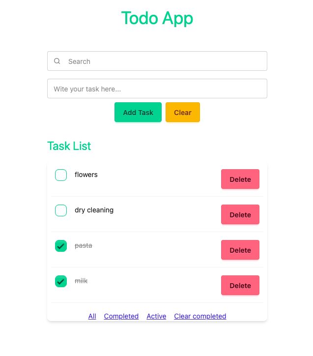

# todo_mvp

## Todo MVP

A simple, modern task manager built with Django and HTMX. This project demonstrates a minimal yet elegant implementation of a todo list web application.

### Features

- Add, view, edit, and delete tasks
- Mark tasks as completed or active
- Filter tasks by status (All, Completed, Active)
- Bulk-delete completed tasks
- Clean UI using TailwindCSS and DaisyUI
- Dynamic interface updates with HTMX

### Getting Started

1. **Clone the repository:**
   ```bash
   git clone https://github.com/your-username/todo_mvp.git
   cd todo_mvp
   ```

2. **Install dependencies:**
   (Recommended) Create and activate a virtual environment:
   ```bash
   python -m venv venv
   # On Windows
   venv\Scripts\activate
   # On macOS/Linux
   source venv/bin/activate
   ```

   ```bash
   pip install -r requirements.txt
   ```

3. **Apply migrations:**
   ```bash
   python manage.py migrate
   ```

4. **Run the development server:**
   ```bash
   python manage.py runserver
   ```

5. **Access in your browser:**
   ```
   http://127.0.0.1:8000/
   ```

### Core Technologies

- **Backend:** Django
- **Frontend:** HTMX, TailwindCSS, DaisyUI
- **Templates:** Django Templating Language

### Screenshots

> 

### Customization

- Change task model or add user authentication as needed for your use case.
- UI can be customized via TailwindCSS utility classes.

---

**Enjoy your productive day with Todo MVP!**
